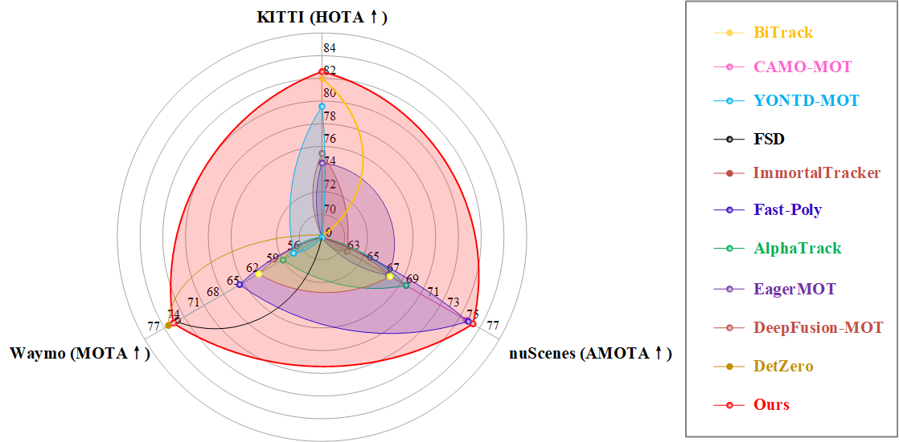

<div  align=center></div>

## <p align=center>MCTrack: A Unified 3D Multi-Object Tracking Framework for Autonomous</p> 

<p align="center">
  <a href="https://paperswithcode.com/sota/3d-multi-object-tracking-on-nuscenes?p=mctrack-a-unified-3d-multi-object-tracking">
    
  </a>
  
</div>

<p align="center">
  <a href="https://paperswithcode.com/sota/3d-multi-object-tracking-on-kitti-1?p=mctrack-a-unified-3d-multi-object-tracking">
    
  </a>
</div>


<p align="center">
  <a href="https://paperswithcode.com/sota/3d-multi-object-tracking-on-waymo-open?p=mctrack-a-unified-3d-multi-object-tracking">
    
  </a>
</div>

  <br>
  <div align="center">
  <a href='https://arxiv.org/abs/2409.16149'></a>
  </div>
  <br>


## 0. Abstract

This paper introduces MCTrack, a new 3D multi-object tracking method that achieves state-of-the-art (SOTA) performance across KITTI, nuScenes, and Waymo datasets. Addressing the gap in existing tracking paradigms, which often perform well on specific datasets but lack generalizability, MCTrack offers a unified solution. Additionally, we have standardized the format of perceptual results across various datasets, termed BaseVersion, facilitating researchers in the field of multi-object tracking (MOT) to concentrate on the core algorithmic development without the undue burden of data preprocessing. Finally, recognizing the limitations of current evaluation metrics, we propose a novel set that assesses motion information output, such as velocity and acceleration, crucial for downstream tasks.
<p align="center"></p>

## 1. News

- **[🔥🔥🔥2024-10-08]**. The code has been released.🙌
- 2024-09-24. MCTrack is released on [arXiv](https://arxiv.org/).
- 2024-09-01. We rank **2nd** among all methods on **Waymo** Dataset for [MOT](https://waymo.com/open/challenges/2020/3d-tracking/).
- 2024-08-30. We rank **1st** among all methods on **KITTI** Dataset for [MOT](http://www.cvlibs.net/datasets/kitti/eval_tracking.php).
- 2024-08-27. We rank **1st** among all methods on **nuScenes** Dataset for [MOT](https://www.nuscenes.org/tracking?externalData=all&mapData=all&modalities=Any).
  

## 2. Results

### [KITTI](https://www.cvlibs.net/datasets/kitti/eval_tracking_detail.php?result=236cb88ca975231d7a3ed33556025e177d0eab20)

#### online

| **Method** | **Detector** | **Set** | **HOTA** | **MOTA** | **TP** | **FP** | **IDSW** |
| --- | --- | --- | --- | --- | --- | --- | --- |
| **MCTrack** | VirConv | test | 81.07 | 89.81 | 32367 | 2025 | 46  |
| **MCTrack** | VirConv | train | 82.65 | 85.19 | 22186 | 1659 | 22  |

#### offline

| **Method** | **Detector** | **Set** | **HOTA** | **MOTA** | **TP** | **FP** | **IDSW** |
| --- | --- | --- | --- | --- | --- | --- | --- |
| **MCTrack** | VirConv | test | 82.75 | 91.79 | 32095 | 2297 | 11  |
| **MCTrack** | VirConv | train | 83.89 | 86.56 | 22150 | 1311 | 3  |

### [nuScenes](https://www.nuscenes.org/tracking?externalData=all&mapData=all&modalities=Any)

| Method | Detector | Set | AMOTA | MOTA | TP  | FP  | IDS |
| --- | --- | --- | --- | --- | --- | --- | --- |
| **MCTrack** | LargeKernel3D | test | 0.763 | 0.634 | 103327 | 19643 | 242 |
| **MCTrack** | CenterPoint | val | 0.740 | 0.640 | 85900 | 13083 | 275 |


### [Waymo](https://waymo.com/open/challenges/tracking-3d/results/90b4c398-afcf/1725037468534000/)

| Method | Detector | Set | MOTA / L1 | MOTP / L1 | MOTA / L2 | MOTP / L2 |
| --- | --- | --- | --- | --- | --- | --- |
| **MCTrack** | CTRL | test | 0.7504 | 0.2276 | 0.7344 | 0.2278 |
| **MCTrack** | CTRL | val | 0.7384 | 0.2288 | 0.7155 | 0.2293 |

## 3. Data preparation
### BaseVersion Data Generation
- First, you need to download the original datasets from [Kitti](https://www.cvlibs.net/datasets/kitti/eval_tracking.php), [nuScenes](https://www.nuscenes.org/tracking/?externalData=all&mapData=all&modalities=Any), and [Waymo](https://waymo.com/open/download/), as well as their corresponding [detection results](), and organize them in the following directory structure. (Note: If you only want to test on the KITTI dataset, you only need to download the KITTI data.)
  - For KITTI
    ```
    data/
    └── kitti/
        ├── datasets/
        |    ├── testing/
        |    |    ├── calib/
        |    |    |   └── 0000.txt
        |    |    └── pose/
        |    |        └── 0000.txt
        |    └── training/
        |         ├── calib/
        |         ├── label_02/
        |         └── pose/
        └── detectors/
             ├── casa/
             │    ├── testing/
             │    │   ├── 0000/
             │    │   │   └── 000000.txt
             │    │   │   └── 000001.txt             
             │    │   └── 0001/
             │    └── testing/
             └── point_rcnn/
  - For nuScenes
    ```
    data/
    └── nuScenes/
        ├── datasets/
        |    ├── maps/
        |    ├── samples/
        |    ├── sweeps/
        |    ├── v1.0-test/
        |    └── v1.0-trainval/
        └── detectors/
             ├── centerpoint/
             |   └── val.json
             └── largekernel/
                 └── test.json
    ```
  - For Waymo
    - To prepare the Waymo data, you first need to follow [ImmortalTracker](https://github.com/esdolo/ImmortalTracker)'s instructions to extract `ego_info` and `ts_info` (we will also provide these in the link, so you might be able to skip this step.).

    - Follow [ImmortalTracker](https://github.com/esdolo/ImmortalTracker)'s instructions to convert detection results into to `.npz` files.

    - Please note that we have modified the `ego_info` section in immortaltracker, and the updated file is provided in `preprocess/ego_info.py`.
    ```
    data/
    └── Waymo/
        ├── datasets/
        |    ├── testing/
        |    |    ├── ego_info/
        |    |    │   ├── .npz
        |    |    │   └── .npz             
        |    |    └── ts_info/
        |    |        ├── .json
        |    |        └── .json          
        |    └── validation/
        |         ├── ego_info/
        |         └── ts_info/
        └── detectors/
             └── ctrl/
                  ├── testing/
                  │   ├── .npz
                  │   └── .npz        
                  └── validation/
                      ├── .npz
                      └── .npz 
    ```
- Second, run the following command to generate the BaseVersion data format required for MCTrack. Certainly, if you do not wish to regenerate the data, you can directly download the data we have prepared from [Google Drive](https://drive.google.com/drive/folders/15QDnPR9t3FO18fVzCyqUu4h-7COl9Utd?usp=sharing) and [Baidu Cloud](https://pan.baidu.com/s/1Fk6EPeIBxThFjBJuMMKQCw?pwd=6666). Due to copyright issues with the Waymo dataset, we are unable to provide the corresponding converted data.
    ```
    $ python preprocess/convert2baseversion.py --dataset kitti/nuscenes/waymo
    ```
- Eventually, you will get the data format of baseversion in the path `data/base_version/`.
    ```
    data/
    └── base_version/
        ├── kitti/
        │   ├── casa/
        │   |   ├── test.json
        │   |   └── val.json
        │   └── virconv/
        │       ├── test.json
        │       └── val.json
        ├── nuscenes/
        |   ├── centerpoint/
        |   │   └── val.json
        |   └── largekernel/
        |        └── test.json
        └── waymo/
            └── ctrl/
                ├── val.json
                └── test.json
    ```

### BaseVersion Data Format

```
scene-0001/
├── frame_0/
│   ├── cur_sample_token                # for nuScenes
│   ├── timestamp                       # The timestamp of each frame
│   ├── bboxes/                         # Detected bbox
│   │   ├── bbox_1/                     # Bbox1
│   │   │   ├── detection_score         # Detection score
│   │   │   ├── category                # Category
│   │   │   ├── global_xyz              # Center position of the global bbox
│   │   │   ├── global_orientation      # Orientation quaternion
│   │   │   ├── global_yaw              # Yaw
│   │   │   ├── lwh                     # Length, width, and height of the bbox
│   │   │   ├── global_velocity         # Velocity of the object in the global coordinate 
│   │   │   ├── global_acceleration     # Acceleration of the object in the global coordinate 
│   │   │   └── bbox_image/             # Information of the bbox in the image coordinate
│   │   │       ├── camera_type         # Camera position
│   │   │       └── x1y1x2y2            # Image coordinates
│   │   ├── bbox_2/
│   │   │   ├── detection_score
│   │   │   ├── category
│   │   │   └── ...
│   │   └── ...
│   └── transform_matrix/
│       ├── global2ego                 # Transformation matrix from global to ego 
│       ├── ego2lidar                  # Transformation matrix from ego to lidar
│       ├── global2lidar               # Transformation matrix from global to lidar 
│       └── cameras_transform_matrix/  # Camera-related transformation matrix
│           ├── CAM_FRONT/             # Front-view camera
│           │   ├── image_shape        # Image shape
│           │   ├── ego2camera         # Transformation matrix from ego to camera
│           │   ├── camera2image       # Transformation matrix from camera to image
│           │   ├── lidar2camera       # Transformation matrix from lidar to camera
│           │   ├── camera_token       # for nuScenes
│           │   └── camera_path        # for nuScenes
│           ├── CAM_FRONT_RIGHT/
│           │   └── ...
│           └── ...
├── frame_1/
│   └── ...
└── ...
```


## 4. Installation

### Basic environment configuration

#### Create virtual environment
```
$ conda create -n MCTrack python=3.8
```
#### Activate virtual environment
```
$ conda activate MCTrack
```
#### Install Python package
```
$ pip install -r requirements.txt
```

### Dataset configuration
#### nuScenes and KITTI 
- For KITTI and nuScenes, you can run `MCTrack` directly after installing the required packages as mentioned above.

#### Waymo

- Please follow the [official tutorial](https://github.com/waymo-research/waymo-open-dataset/blob/master/tutorial/tutorial.ipynb) to install waymo_open_dataset package

- Use the following command to verify if the installation was successful. 

  ```
  $ cd /content/waymo-od/src/ && bazel-bin/waymo_open_dataset/metrics/tools/compute_detection_metrics_main waymo_open_dataset/metrics/tools/fake_predictions.bin  waymo_open_dataset/metrics/tools/fake_ground_truths.bin
  ```

## 5. Evaluation

### Local evaluation 
- Run directly:
  ```
  $ python main.py --dataset kitti/nuscenes/waymo -e -p 1
  ```
- For example, if you want to run kitti evaluation:
  ```
  $ python main.py --dataset kitti -e -p 1
  ```

- If you want to run the tracking evaluation faster, you can use multi-processing:
  ```
  $ python main.py --dataset kitti -e -p 8
  ```

- The results are saved in the ```results``` folder. You can modify the evaluation parameters in the ```config/kitti.yaml``` file. ```-e``` represents whether to evaluate the results.

- Note: for waymo dataset, you should modify the `waymo_open_dataset package path` to your `WOD path` first

    ```
    $ vim evaluation/static_evaluation/waymo/eval.py
    ```

### Submit

#### KITTI

- If you want to submit the test set results online, you need to change  ```SPLIT:``` to ```test``` and ```DETECTOR:``` to ```virconv``` in the ```config/kitti.yaml``` file. Then, rerun the tracking program to generate the ```0000.txt/0001.txt/.../0028.txt``` files. After that, compress that into a `.zip` file and submit it to the [kitti tracking challenge](https://www.cvlibs.net/datasets/kitti/user_submit.php).

#### nuScenes
- If you want to submit the test set results online, you need to change  ```SPLIT:``` to ```test``` and ```DETECTOR:``` to ```largekernel``` in the ```config/nuscenes.yaml``` file. Then, rerun the tracking program to generate the ```result.json``` file. After that, compress the ```result.json``` into a `.zip` file and submit it to the [nuScenes tracking challenge](https://eval.ai/web/challenges/challenge-page/476/overview).


#### Waymo

- Modify the submission file with your information 

  ```
  $ vim waymo-od/src/waymo_open_dataset/metrics/tools/submission.txtpb
  ```
- Generate the result

  ```
  $ mkdir test_result
  $ waymo-od/src/bazel-bin/waymo_open_dataset/metrics/tools/create_submission  --input_filenames='results/waymo/testing/bin/pred.bin' --output_filename='test_result/model' --submission_filename='waymo-od/src/waymo_open_dataset/metrics/tools/submission.txtpb'
  $ tar cvf test_result/my_model.tar test_result/
  $ gzip test_result/my_model.tar
  ```

- Submit your result to the [waymo tracking challenge](https://waymo.com/open/challenges/2020/3d-tracking/).


### Motion metric evaluation

- TODO:Currently, we are only conducting motion metric evaluations on the nuScenes dataset.

- If you are interested in our motion metric evaluation, you first need to convert the tracking result files (```result_for_motion.json```) into a format suitable for motion metric evaluation by running:

  ```
  $ python preprocess/motion_dataset/convert_nuscenes_result_to_pkl.py
  ```

- ```result_path``` represents the path where the tracking program saves the results(```result_for_motion.json```), ```nusc_path``` refers to the original path of the nuScenes dataset, and ```gt_pkl_path```, ```det_pkl_path```, ```kalman_cv_pkl_path```, ```diff_pkl_path``` and ```curve_pkl_path``` represent the data files used for motion metric evaluation.

- Next, run:
  ```
  $ python evaluation/eval_motion.py
  ```
- You will then obtain the results of the motion metric evaluation. The ```config/nuscenes_motion_eval.yaml``` file contains the parameters for motion metric evaluation.

🌟 Don't forget to drop us a star on GitHub and follow the repo to stay up to date!

[](https://star-history.com/#megvii-research/MCTrack&Date)


## 6. Acknowledgement

- In the detection part, many thanks to the following open-source projects:
  
  - [CTRL](https://github.com/tusen-ai/SST?tab=readme-ov-file)
    
  - [VirConv](https://github.com/hailanyi/VirConv)
    
  - [CenterPoint](https://github.com/tianweiy/CenterPoint)
    
- In the tracking part, many thanks to the following open-source projects:
  
  - [PC3T](https://github.com/hailanyi/3D-Multi-Object-Tracker)
    
  - [Poly-MOT](https://github.com/lixiaoyu2000/Poly-MOT)

  - [ImmortalTracker](https://github.com/esdolo/ImmortalTracker)
    

## 7. Citation
If you find this work useful, please consider to cite our paper:
```
@article{wang2024mctrack,
  title={MCTrack: A Unified 3D Multi-Object Tracking Framework for Autonomous Driving},
  author={Wang, Xiyang and Qi, Shouzheng and Zhao, Jieyou and Zhou, Hangning and Zhang, Siyu and Wang, Guoan and Tu, Kai and Guo, Songlin and Zhao, Jianbo and Li, Jian and others},
  journal={arXiv preprint arXiv:2409.16149},
  year={2024}
}
```
