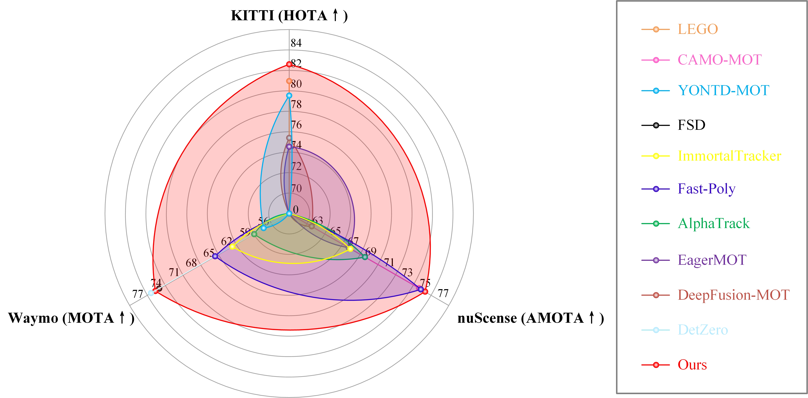

# MCTrack

This is the official repo release of the paper [MCTrack: Unified 3D Multi-Object Tracking Framework for Autonomous](https://arxiv.org/abs/2409.16149)

## 0. Abstract

This paper introduces MCTrack, a new 3D multi-object tracking method that achieves state-of-the-art (SOTA) performance across KITTI, nuScenes, and Waymo datasets. Addressing the gap in existing tracking paradigms, which often perform well on specific datasets but lack generalizability, MCTrack offers a unified solution. Additionally, we have standardized the format of perceptual results across various datasets, termed BaseVersion, facilitating researchers in the field of multi-object tracking (MOT) to concentrate on the core algorithmic development without the undue burden of data preprocessing. Finally, recognizing the limitations of current evaluation metrics, we propose a novel set that assesses motion information output, such as velocity and acceleration, crucial for downstream tasks.

## 1. News

- 2024-××-××. The code will be released soon.🙌
- 2024-09-24. MCTrack is released on [arXiv](https://arxiv.org/)😘.
- 2024-09-01. We rank **2th** among all methods on **Waymo** Dataset for [MOT](http://www.cvlibs.net/datasets/kitti/eval_tracking.php)😊.
- 2024-08-30. We rank **1th** among all methods on **KITTI** Dataset for [MOT](http://www.cvlibs.net/datasets/kitti/eval_tracking.php)😁.
- 2024-08-27. We rank **1th** among all methods on **nuScenes** Dataset for [MOT](http://www.cvlibs.net/datasets/kitti/eval_tracking.php)😀.
  

## 2. Results

### [KITTI]()

#### online

| **Method** | **Detector** | **Set** | **HOTA** | **MOTA** | **TP** | **FP** | **IDSW** |
| --- | --- | --- | --- | --- | --- | --- | --- |
| **MCTrack** | VirConv | testing | 80.78 | 89.82 | 32204 | 2188 | 65  |

#### offline

| **Method** | **Detector** | **Set** | **HOTA** | **MOTA** | **TP** | **FP** | **IDSW** |
| --- | --- | --- | --- | --- | --- | --- | --- |
| **MCTrack** | VirConv | testing | 82.46 | 91.46 | 32031 | 2361 | 12  |

### [nuScenes]()

| Method | Detector | Set | AMOTA | MOTA | TP  | FP  | IDS |
| --- | --- | --- | --- | --- | --- | --- | --- |
| MCTrack | LargeKernel3D | test | 0.761 | 0.631 | 101797 | 18241 | 292 |

### [Waymo]()

| Method | Detector | Set | MOTA / L1 | MOTP / L1 | MOTA / L2 | MOTP / L2 |
| --- | --- | --- | --- | --- | --- | --- |
| MCTrack | LargeKernel3D | test | 0.7504 | 0.2276 | 0.7344 | 0.2278 |

## 3. Data preparation

TBD

## 4. Installation

TBD

## 5. Evaluation
TBD

## 6. Acknowledgement

- In the detection part, many thanks to the following open-source projects:
  
  - [FSD]([GitHub - tusen-ai/SST: Code for a series of work in LiDAR perception, including SST (CVPR 22), FSD (NeurIPS 22), FSD++ (TPAMI 23), FSDv2, and CTRL (ICCV 23, oral).](https://github.com/tusen-ai/SST?tab=readme-ov-file))
    
  - [VirConv]([GitHub - hailanyi/VirConv: Virtual Sparse Convolution for Multimodal 3D Object Detection](https://github.com/hailanyi/VirConv))
    
  - [CenterPoint]([GitHub - tianweiy/CenterPoint](https://github.com/tianweiy/CenterPoint))
    
- In the tracking part, many thanks to the following open-source projects:
  
  - [PC3T]([GitHub - hailanyi/3D-Multi-Object-Tracker: A project for 3D multi-object tracking](https://github.com/hailanyi/3D-Multi-Object-Tracker))
    
  - [Poly-MOT]([GitHub - lixiaoyu2000/Poly-MOT: Official Repo For IROS 2023 Accepted Paper &quot;Poly-MOT&quot;](https://github.com/lixiaoyu2000/Poly-MOT))
    

## 7. Citation
